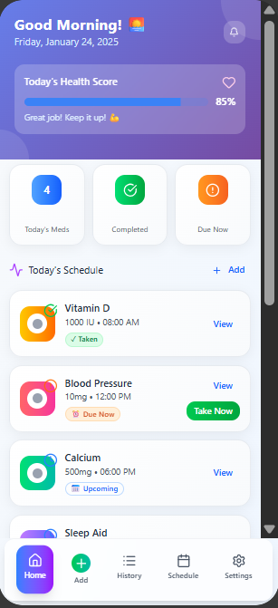
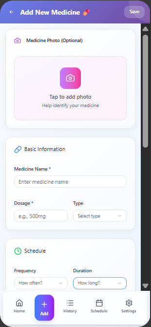
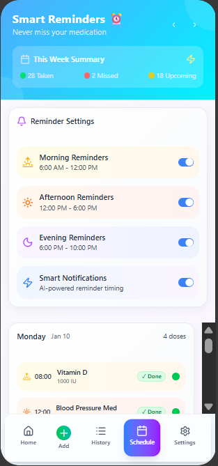

💊 MedAlert - Application Mobile de Rappel de Médicaments

MedAlert est une application mobile cross-platform (iOS & Android) conçue pour aider les utilisateurs à gérer leurs prises de médicaments de manière simple, fiable et accessible à tous.

Ce projet est construit avec React Native et Expo, en mettant l'accent sur une expérience utilisateur claire et une accessibilité maximale, en particulier pour les seniors.

✨ Fonctionnalités (Features)

Basé sur notre document de conception, MedAlert offre les services suivants :

Tableau de Bord Quotidien : Visualisez rapidement les médicaments à prendre aujourd'hui, avec un statut clair (Pris, En attente, À venir).

Gestion Complète des Médicaments : Ajoutez, modifiez et suivez vos médicaments avec des détails complets (dosage, type, fréquence, durée, notes, etc.).

Calendrier Hebdomadaire : Un affichage clair de votre planning de prises pour toute la semaine.

Notifications Intelligentes : Recevez des rappels fiables pour chaque prise. Les notifications peuvent être personnalisées (son, vibration, snooze).

Suivi d'Observance : Suivez vos progrès avec des statistiques d'observance (ex: "92% adherence") pour rester motivé.

Gestion des Données : Exportez votre historique de prises (idéal pour un rendez-vous médical) ou supprimez vos données.

🎯 Public Cible

L'application est conçue pour tous, mais avec une attention particulière pour :

Seniors (60 ans+) : Interface très lisible, gros caractères, et navigation simple.

Adultes Actifs (30-59 ans) : Actions rapides, notifications discrètes et efficacité.

Jeunes Adultes (18-29 ans) : Une interface moderne, esthétique et intuitive.

🛠️ Tech Stack (Socle Technique)

Framework : React Native avec Expo

Navigation : Expo Router (File-based routing)

Langage : TypeScript

Icônes : Lucide React Native

Styles : StyleSheet (avec un système de "Theme" personnalisé)

(Backend prévu : Firebase / Firestore pour la synchronisation des données)

🚀 Démarrage Rapide (Get Started)

Ce projet est un projet Expo standard.

Installer les dépendances

npm install

Lancer l'application

npx expo start

Ceci lancera Metro. Vous pourrez ensuite :

Appuyer sur a pour ouvrir dans un émulateur Android.

Appuyer sur i pour ouvrir dans un simulateur iOS.

Scanner le QR code avec l'application Expo Go sur votre téléphone.

Le développement principal se fait dans le dossier app/.

📸 Captures d'écran (Screenshots)

(Vous pouvez insérer ici des captures d'écran de l'application)

Accueil

Ajout Médicament

Calendrier

📄 Licence

Ce projet est sous licence MIT. Voir le fichier LICENSE pour plus de détails.